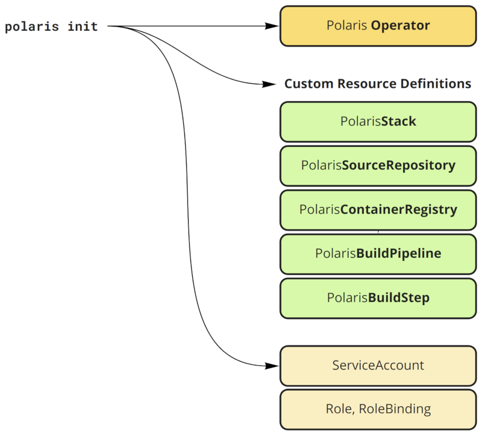

# Polaris CLI

*Polaris development currently in **pre-release***

The Polaris CLI is a tool designed to make it easier for developers to scaffold and deploy micro-services on a Kubernetes cluster. The Polaris CLI works best with the [Polaris](https://github.com/synthesis-labs/polaris) stack and [other Polaris tools](https://github.com/synthesis-labs?utf8=%E2%9C%93&q=polaris&type=&language=). 

Download the pre-release [here](https://github.com/synthesis-labs/polaris-cli/releases)

# Getting Started

## 1. Scaffold your project

```sh
$ polaris init
$ polaris project new myproject --parameters cluster_name=p1.s7s.cloud
$ cd myproject
$ polaris component new myservice --from core/stable/starter/nodejs/typescript-microservice
```

Output:

```sh
├── chart
│   └── myproject
│       ├── charts
│       │   └── myservice
│       │       ├── Chart.yaml
│       │       ├── templates
│       │       │   ├── build-step.yaml
│       │       │   ├── container-registry.yaml
│       │       │   ├── deployment.yaml
│       │       │   ├── _helpers.tpl
│       │       │   ├── ingress.yaml
│       │       │   └── service.yaml
│       │       └── values.yaml
│       ├── Chart.yaml
│       ├── templates
│       │   ├── build-pipeline.yaml
│       │   ├── _helpers.tpl
│       │   ├── NOTES.txt
│       │   └── source-repo.yaml
│       └── values.yaml
├── images
│   └── myservice
│       ├── Dockerfile
│       └── src
└── polaris-project.yaml
```

- **polaris-project.yaml**: The base configuration file of your polaris porject
- **chart**: A helm chart to install your polaris project
- **images**: The docker images of your polaris project

## 2. Install to your cluster with helm

```sh
$ helm install --name myproject chart/myproject/

$ git init # Assuming you don't have a git repo already
$ git remote add cluster https://git-codecommit.eu-west-1.amazonaws.com/v1/repos/myproject
$ git add -A
$ git commit -m 'first commit'
$ git push cluster master # Assuming aws cli credentials have been setup
```

Give AWS CodePipeline some time to build your images

# Concepts

## Scaffolds

A scaffold is a set of templates that is used to bootstrap a micro-service app to be modified by the developer and then easily deployed onto a cluster. Scaffolds are contained in repositories. You can use an existing scaffold or create your own.

## Repositories

A repository (or repo) is used to easily manage and source scaffolds. You can use the [Official Polaris Scaffold Repo](https://github.com/synthesis-labs/polaris-scaffolds), use a third party repo or create your own.

## Projects

A project is scaffold that has been unpacked into a local directory ready to be deployed into a cluster.

# Commands

## Polaris Init



Installs the polaris operator to the cluster.

```
polaris init [--namespace] [--verbose]
```

Flags:
```
--namespace - The cluster namespace in which the polaris operator should be installed. (Uses the default
              configured namespace if not specified)
--verbose - Enable verbose output
```

## Polaris Project

The following commands are used to manage projects.

### List

Lists available scaffolds to create projects from.

```
polaris project list [--verbose]
```

Flags:
```
--verbose - Enable verbose output
```

### Describe

Provides a description for the named scaffold.

```
polaris project describe <name> [--verbose]
```

Arguments:
```
name (required) - The name of the scaffold
```

Flags:
```
--verbose - Enable verbose output
```

### New

Unpacks a scaffold into a local project.

```
polaris project new <local name> [--from] [--overwrite] [--parameters] [--verbose]
```

Arguments:
```
local name (required) - the desired name/path of the local unpacked scaffold
```

Flags:
```
--from - From which scaffold upstream (defaults to core/stable/starter/project)
--overwrite - Allow overwriting of target files
--parameters - parameters used to populate the scaffold template
--verbose - Enable verbose output
```

### Status

*WIP*

## Polaris Component

The following commands are used to manage components.

### List

List available components to scaffold into a project

```
polaris component list
```

### New

Unpack a component into a local project

```
polaris component new <local name> [--from] [--overwrite] [--parameters]
```

Arguments:
```
local name (required) -- the desired name/path of the local unpacked component
```

Flags:
```
--from - From which component upstream (defaults to core/stable/starter/kotlin/microservice)
--overwrite - Allow overwriting of target files
--parameters - parameters used to populate the component template
```

### Describe

*WIP*

## Polaris Repo

These commands are used to interact with repositories containing scaffolds.

### Add

Add the specified repo to the local repo list.

```
polaris repo add <name> <url> <ref> [--verbose]
```

Arguments:
```
name (required) - the name of the repository
url (required) - the git URL of the repository
ref (required) - the desired git commit reference (branch) of the repository
```

Flags:
```
--verbose - Enable verbose output
```

### List

Lists all added repositories.

```
polaris repo list [--verbose]
```

Flags:
```
--verbose - Enable verbose output
```

### Remove

Removes the specified repository if it has been added.

```
polaris repo remove <name> [--verbose]
```

Arguments:
```
name (required) - the name of the repository to be removed
```

Flags:
```
--verbose - Enable verbose output
```

### Update

Performs an update on all added repositories.

```
polaris repo update [--verbose]
```

Flags:
```
--force - forces a full refresh (delete and re-download) of all added repositories
--verbose - Enable verbose output
```
